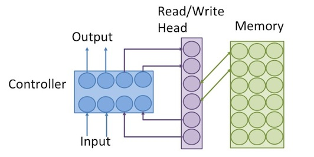

# Neural Turing Machines PyTorch Implementation

PyTorch Implementation of [Neural Turing Machines, arxiv:1410.5401](https://arxiv.org/abs/1410.5401)




## Installation
```
$ git clone https://github.com/kuc2477/pytorch-ntm && cd pytorch-ntm
$ pip install -r requirements.txt
```


## CLI
Implementation CLI is provided by `main.py`.

#### Usage 
```
usage: Neural Turing Machine PyTorch Implementation [-h]
                                                    [--task {copy,repeat_copy}]
                                                    [--hidden-size HIDDEN_SIZE]
                                                    [--memory-size MEMORY_SIZE]
                                                    [--memory-feature-size MEMORY_FEATURE_SIZE]
                                                    [--head-num HEAD_NUM]
                                                    [--max-shift-size MAX_SHIFT_SIZE]
                                                    [--iterations ITERATIONS]
                                                    [--batch-size BATCH_SIZE]
                                                    [--test-size TEST_SIZE]
                                                    [--weight-decay WEIGHT_DECAY]
                                                    [--lr LR]
                                                    [--lr-decay LR_DECAY]
                                                    [--lr-decay-iterations LR_DECAY_ITERATIONS [LR_DECAY_ITERATIONS ...]]
                                                    [--checkpoint-interval CHECKPOINT_INTERVAL]
                                                    [--eval-log-interval EVAL_LOG_INTERVAL]
                                                    [--gradient-log-interval GRADIENT_LOG_INTERVAL]
                                                    [--loss-log-interval LOSS_LOG_INTERVAL]
                                                    [--model-dir MODEL_DIR]
                                                    [--resume-best | --resume-latest]
                                                    [--best] [--no-gpus]
                                                    (--train | --test)

```

#### Train
```
$ python -m visom.server &
$ ./main.py --train [--resume-latest | --resume-best] --task=[copy | repeat_copy]
```

#### Test
```
$ ./main.py --test --task=[copy | repeat_copy]
```


## Reference
- [Neural Turing Machines, arxiv:1410.5401](https://arxiv.org/abs/1410.5401)
- [pytorch-ntm](https://github.com/loudinthecloud/pytorch-ntm)


## Author
Ha Junsoo / [@kuc2477](https://github.com/kuc2477) / MIT License
